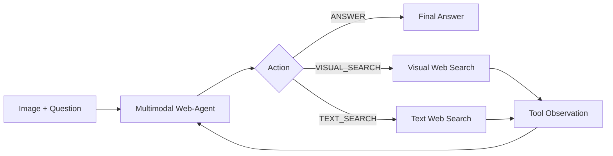
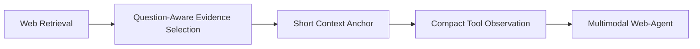

# Multimodal Web-Agent

[English](README_en-EN.md) | **简体中文**

> 基于 **Qwen2.5-VL-3B**、**Protocol-SFT** 与 **GRPO** 构建的 Multimodal Web-Agent，使多模态模型能够自主调用真实视觉/文本 Web Search，并利用外部知识完成视觉问答。

**Multimodal Web-Agent** 面向知识密集型多模态问答场景。

与固定的 `Image → Search → Answer` 流水线不同，本项目让模型根据当前图像、问题和已有工具信息自主决定：

* 直接回答；
* 发起视觉 Web Search；
* 发起文本 Web Search；
* 利用 Tool Observation 继续决策并生成最终答案。

项目完整覆盖：

```text
Tool-Use 数据构建
        ↓
Protocol-SFT
        ↓
GRPO
        ↓
Multimodal Web-Agent
        ↓
Real Web Search
        ↓
Agent Evaluation
```

同时针对 3B 级多模态模型设计了紧凑的 **Agent-facing Evidence Interface**，用于提高模型对 Web Evidence 的利用效率。

---

## ✨ Highlights

* **Multimodal Web-Agent**：支持 `ANSWER / VISUAL_SEARCH / TEXT_SEARCH` 三类自主动作。
* **Real Web Search**：支持真实视觉与文本 Web Search，而非仅模拟 Tool Calling。
* **Protocol-SFT + GRPO**：先完成 Agent 协议冷启动，再通过强化学习优化工具使用策略和搜索增强回答能力。
* **Search-aware Evaluation**：分别评估 Search-free 与 Search-required 场景，观察搜索能力提升是否影响模型基础能力。
* **External Multimodal Evaluation**：在 E-VQA 外部知识型视觉问答数据上验证最终系统。
* **Agent-facing Evidence Interface**：对检索结果进行 Question-Aware Evidence Selection、Context Anchoring 与压缩，降低小模型 Tool Observation 负担。
* **Reproducible Pipeline**：提供数据构建、训练、Raw/NoTool/Frozen/Replay/Live-Web 评测和执行契约测试。

---

## 🧠 Agent Overview

Agent 的核心动作空间为：

```text
ANSWER
VISUAL_SEARCH
TEXT_SEARCH
```

整体运行逻辑：



当模型选择搜索动作后，Agent Runtime 会实际执行对应的 Web Search，并将返回结果组织为 Tool Observation，再交给模型进行后续决策。

因此工具使用策略由模型自身决定，而不是由外部程序固定指定搜索流程。

---

## 🚀 Training Pipeline

项目采用两阶段训练：

```text
Qwen2.5-VL-3B-Instruct
          │
          ▼
     Protocol-SFT
          │
          ▼
         GRPO
          │
          ▼
Multimodal Web-Agent v0.1
```

公开文档中统一将最终 GRPO Agent 称为：

> **Multimodal Web-Agent v0.1**

部分代码、配置文件和历史 artifact 中仍保留 `reward_v21` 等实验标识，以保证已有实验和复现脚本不被破坏；这些标识不作为公开模型名称。

---

### Stage 1 — Protocol-SFT

第一阶段基于 **FVQA** 构建结构化 Tool-Use 数据，对基础模型进行 Protocol-SFT。

该阶段主要完成 Agent protocol cold-start，使模型学习：

* Tool Action 格式；
* Visual / Text Search Query 生成；
* Tool Observation 消费；
* 搜索后的继续决策；
* 最终答案生成。

公开 Protocol-SFT Dev-100 结果：

| Metric             | Protocol-SFT |
| ------------------ | -----------: |
| Protocol Validity  |   **100.0%** |
| Exactly One Action |   **100.0%** |
| Action Accuracy    |    **70.0%** |
| Macro Action F1    |   **78.65%** |
| Malformed Rate     |     **0.0%** |

Protocol-SFT 的目标是让原始 VLM 稳定掌握结构化 Tool-Use Protocol，为后续策略优化提供可靠初始化。

---

### Stage 2 — GRPO

第二阶段从 Protocol-SFT 模型初始化，通过 **GRPO** 进一步优化：

* Tool-Use Policy；
* Search / Answer 决策；
* Search-required 场景下的回答质量；
* Web-assisted Answering。

正式 GRPO 训练规模为：

```text
Prompts:           2,048
Group Size:        4
Total Rollouts:    8,192
Optimizer Updates: 512
```

相较 Protocol-SFT，GRPO 在真正需要外部信息的 **Search-required** 样本上提升更加明显：

| Metric                       | Protocol-SFT | Multimodal Web-Agent v0.1 |           Δ |
| ---------------------------- | -----------: | ------------------------: | ----------: |
| Overall EM                   |       33.50% |                **37.50%** |     +4.00pp |
| Overall Token-F1             |       39.16% |                **42.73%** |     +3.57pp |
| **Search-required EM**       |       40.67% |                **47.33%** | **+6.66pp** |
| **Search-required Token-F1** |       45.97% |                **52.49%** | **+6.52pp** |

这表明 GRPO 的主要收益集中在需要外部知识和工具使用的场景，而不仅是整体指标变化。

完整训练配置与执行方式见：

* [`docs/TRAINING.md`](docs/TRAINING.md)

---

## 🌐 Real Web Search Evaluation

模型会调用工具并不意味着工具真正改善了最终任务。

因此项目分别评估：

1. **Raw → Final Agent**：观察完整训练 + Agent 系统带来的变化；
2. **Live Web → NoTool**：在固定同一训练后模型的情况下，衡量 Web Tool 本身的任务级效用。

---

### O1-100 Live-Web

O1-100 包含：

* Search-free；
* Visual-search-required；
* Text-search-required；
* Mixed-search-required。

下面首先展示最能体现自主单工具搜索能力的 Search-free、Visual-search-required 和 Text-search-required 结果。

所有结果均使用完全相同的 sample IDs，数值为 `EM / Token-F1 (%)`。

| Subset                          |           Raw | Multimodal Web-Agent v0.1 |                  Δ |
| ------------------------------- | ------------: | ------------------------: | -----------------: |
| Search-free                     | 16.00 / 18.00 |         **16.00 / 20.95** |      +0.00 / +2.95 |
| Visual-search-required          | 24.00 / 32.98 |         **32.00 / 41.00** |  **+8.00 / +8.02** |
| Text-search-required            | 32.00 / 40.33 |         **44.00 / 46.00** | **+12.00 / +5.67** |
| **Single-tool Search-required** | 28.00 / 36.66 |         **38.00 / 43.50** | **+10.00 / +6.85** |

其中 `Single-tool Search-required` 合并 Visual-search-required 与 Text-search-required，共 50 个样本。

结果显示：

* Search-free EM：**16.0% → 16.0%**；
* Visual-search-required EM：**24.0% → 32.0%**；
* Text-search-required EM：**32.0% → 44.0%**。

即最终 Agent 在无需搜索的问题上保持原有 EM，同时在需要视觉或文本 Web Search 的问题上获得更明显提升。

> 完整 O1 结果，包括 Mixed-search-required、全部 Search-required、数据来源拆分、Frozen/Replay 条件以及 bootstrap 统计，见 [`docs/RESULTS.md`](docs/RESULTS.md)。

---

### Web Tool Utility：Live vs NoTool

Raw 与最终 Agent 的差异包含训练和系统变化，因此不能单独解释为 Web Tool 的因果收益。

为了单独衡量工具价值，我们固定 **Multimodal Web-Agent v0.1**，只改变是否允许访问 Web Tool。

O1 Search-required：

| Condition |           EM |     Token-F1 |
| --------- | -----------: | -----------: |
| NoTool    |        1.33% |        2.22% |
| Live Web  |   **32.00%** |   **38.09%** |
| Gain      | **+30.67pp** | **+35.87pp** |

因此：

```text
Raw → Final Agent
```

衡量的是**完整训练与 Agent 系统差异**；

而：

```text
Same Agent: Live Web → NoTool
```

才用于评估 **Web Tool 的任务级效用**。

---

## 🖼️ E-VQA：外部知识型多模态评测

为了进一步验证模型在外部图像问答分布上的能力，本项目使用 E-VQA 构建了一个 **200 样本的 single-hop Agent-compatible evaluation set**。

E-VQA 的问题强调：

* 细粒度视觉实体理解；
* 外部百科知识获取；
* 图像信息与外部 Evidence 的联合使用。

因此这里将 E-VQA 作为：

> **External-Knowledge Multimodal Evaluation**


---

### Raw → Final Agent

在完全相同的 200 个样本上：

| Model                         |          EM |     Token-F1 |
| ----------------------------- | ----------: | -----------: |
| Raw Qwen2.5-VL-3B             |       9.00% |       12.11% |
| **Multimodal Web-Agent v0.1** |  **18.00%** |   **23.00%** |
| Δ                             | **+9.00pp** | **+10.89pp** |

Paired bootstrap 95% CI：

```text
EM:
+9.00pp
95% CI: [+3.50pp, +14.50pp]

Token-F1:
+10.89pp
95% CI: [+4.85pp, +16.83pp]
```

最终系统在该 E-VQA-200 子集上：

* EM：**9.0% → 18.0%**
* Token-F1：**12.11% → 23.0%**
* Protocol Validity：**90.5%**
* Tool-use Rate：**91.0%**

完整统计见：

* [`docs/RESULTS.md`](docs/RESULTS.md)
* [`docs/EVALUATION.md`](docs/EVALUATION.md)

> **Evaluation Note**
>
> E-VQA-200 同时用于 Evidence Interface 的工程迭代，因此本项目将其视为 external Agent-compatible evaluation/development set，而不是 untouched final test set。更严格的泛化验证应在冻结当前系统后使用新的 unseen holdout。

---

## 🔎 Agent-facing Evidence Interface

对于小参数 Multimodal Agent：

> **检索到正确 Evidence，不等于模型能够有效消费这些 Evidence。**

直接向 3B Agent 注入长网页 passage 会增加上下文负担，因此最终系统采用：



最终 Evidence Interface 将 model-visible Tool Observation 从约：

```text
~2.5K characters
        ↓
~0.9K characters
```

对应：

| Metric            | Long Evidence | Compact Evidence Interface |
| ----------------- | ------------: | -------------------------: |
| Protocol Validity |         51.0% |                  **90.5%** |
| EM                |          6.0% |                  **18.0%** |
| Token-F1          |         7.78% |                  **23.0%** |

这一结果体现了项目中的一个核心系统设计观点：

> **Tool quality 不只是 Retrieval Problem，同时也是 Interface Problem。**

对于小型多模态 Agent，Web Retrieval 之后还需要考虑 Evidence Selection、Context Compression 与 Semantic Grounding，才能将搜索结果转化为真正有效的 Agent Observation。

---

## 📊 Key Results

| Stage              | Metric                         | Before / Raw |      Final |
| ------------------ | ------------------------------ | -----------: | ---------: |
| Protocol-SFT       | Protocol Validity              |            — | **100.0%** |
| Protocol-SFT       | Action Accuracy                |            — |  **70.0%** |
| GRPO               | Search-required EM             |       40.67% | **47.33%** |
| GRPO               | Search-required Token-F1       |       45.97% | **52.49%** |
| O1 Live-Web        | Visual-search-required EM      |        24.0% |  **32.0%** |
| O1 Live-Web        | Text-search-required EM        |        32.0% |  **44.0%** |
| O1 Live-Web        | Single-tool Search-required EM |        28.0% |  **38.0%** |
| O1 Live-Web        | Search-free EM                 |        16.0% |  **16.0%** |
| E-VQA-200          | EM                             |         9.0% |  **18.0%** |
| E-VQA-200          | Token-F1                       |       12.11% |  **23.0%** |
| Evidence Interface | Protocol Validity              |        51.0% |  **90.5%** |

详细结果及统计边界见：

* [`docs/RESULTS.md`](docs/RESULTS.md)

---

## 🏷️ Model Naming

本项目对外采用以下模型名称：

| Public Name                   | Description                             |
| ----------------------------- | --------------------------------------- |
| **Protocol-SFT v0.1**         | 完成 Tool-Use Protocol cold-start 的第一阶段模型 |
| **Multimodal Web-Agent v0.1** | 在 Protocol-SFT 基础上通过 GRPO 训练得到的最终 Agent |

为保证历史实验、配置和脚本可复现，代码内部仍可能出现：

```text
reward_v21
grpo_reward_v21
reward_v2_1
```

这些名称属于内部实验标识，并不代表不同的公开模型。

---

## ⚡ Quick Start

### 1. Clone

```bash
git clone https://github.com/yigu666/Multimodal-Web-Agent.git
cd Multimodal-Web-Agent
```

### 2. 创建环境

```bash
conda env create -f environment/environment.yml
conda activate multimodal-web-agent

python -m pip install -e . --no-deps
```

### 3. 验证公开代码

```bash
pytest -q
```

完整依赖与环境信息见：

* [`docs/INSTALL.md`](docs/INSTALL.md)

---

## 📥 Base Model

基础模型不会随仓库重新分发，需要单独下载：

```bash
export MWA_ROOT="$PWD"
export HF_HOME="$MWA_ROOT/.cache/huggingface"
export HF_HUB_CACHE="$HF_HOME/hub"

hf download Qwen/Qwen2.5-VL-3B-Instruct \
  --local-dir "$MWA_ROOT/models/Qwen2.5-VL-3B-Instruct"
```

> 如果本地磁盘空间有限，建议将 Hugging Face cache 显式指向容量充足的磁盘。

---

## 📚 Data

本仓库不重新分发原始数据集。

Protocol-SFT / GRPO 主训练数据来自 **FVQA**，相关公开输入可以通过 Hugging Face 获取。

示例：

```bash
mkdir -p "$MWA_ROOT/data/raw/fvqa"

hf download lmms-lab/FVQA \
  fvqa_train.parquet \
  fvqa_train_image_search_results_cache.pkl \
  --repo-type dataset \
  --revision bb4a4ff4c9c3fd0382d11f5d7fccd66d0b8428b5 \
  --local-dir "$MWA_ROOT/data/raw/fvqa"
```

数据下载、Cache Audit、Protocol-SFT 数据构建与 E-VQA public inputs 详见：

* [`docs/DATA.md`](docs/DATA.md)

> 请勿反序列化来源不可信的 Pickle 文件。

---

## 🏋️ Training

### Protocol-SFT

训练前检查 Loss Mask：

```bash
export CUDA_VISIBLE_DEVICES=0

python scripts/inspect_protocol_sft_mask.py \
  --project-root "$PWD" \
  --config configs/protocol_sft/train_full_format_v1.yaml \
  --all-splits
```

开始 Protocol-SFT：

```bash
python scripts/train_protocol_sft.py \
  --project-root "$PWD" \
  --config configs/protocol_sft/train_full_format_v1.yaml
```

---

### GRPO

构建 GRPO Prompt Pool：

```bash
python scripts/build_grpo_prompt_pool_v1.py

python scripts/audit_grpo_prompt_pool.py \
  --input data/processed/grpo_prompt_pool_v1/train.jsonl \
  --output data/manifests/grpo_prompt_pool_v1_audit.json
```

准备 Reward / Training Contract：

```bash
python scripts/build_reward_v2_coverage_cache.py \
  --config configs/grpo/reward_v2_1_answer_dominant_positive.yaml

python scripts/run_grpo_reward_v2_text_exploration_smoke.py \
  --config configs/grpo/reward_v2_hierarchical_grounded_search.yaml \
  --output-dir outputs/grpo_reward_v2_text_exploration_smoke_128

python scripts/prepare_reward_v21_contract.py
```

开始正式 GRPO：

```bash
python scripts/run_grpo_reward_v2_full.py \
  --training-config configs/grpo/reward_v21_full_server.yaml \
  --output-dir outputs/grpo_reward_v21_full
```

> 上述脚本名称保留历史实验命名，以保证已验证实验路径可复现。对应的公开最终模型名称为 **Multimodal Web-Agent v0.1**。

完整训练说明：

* [`docs/TRAINING.md`](docs/TRAINING.md)

---

## 📏 Evaluation

### O1 Live-Web

Live 模式需要在本地配置对应 Web Search credentials。

**不要将 API Key 提交到 Git。**

```bash
export SERPER_API_KEY="..."
export SERPAPI_API_KEY="..."

python scripts/prepare_online_o1_100.py \
  --config configs/evaluation/online_web_agent_o1_100.yaml

python scripts/run_online_web_agent_v1.py \
  --config configs/evaluation/online_web_agent_o1_100.yaml \
  --phase o1 \
  --backend-mode live \
  --models sft reward_v21 \
  --output-root outputs/online_web_agent_o1_public
```

如已有冻结 evidence snapshot，可使用 Replay / Frozen 模式减少新的远程请求。

> Live-Web 搜索结果会随时间变化。确定性 decoding 并不能保证第三方 Web Search 返回内容永久不变。

---

### Raw Baseline

```bash
export MWA_BASE_MODEL="$PWD/models/Qwen2.5-VL-3B-Instruct"

python evaluation/final_raw_parametric_knowledge_baseline/run_raw_baseline.py
```

---

### E-VQA

首先下载公开输入：

```bash
bash scripts/download_evqa_public_inputs.sh
```

E-VQA 采用 staged、fail-closed 的冻结评测流程。R5 会严格消费前序阶段生成并冻结的 artifact。

完整执行方式见：

* [`docs/EVALUATION.md`](docs/EVALUATION.md)

E-VQA 的 benchmark images、KB、generated evidence、episode outputs 等均保持在 Git 之外。

---

## 🧪 Reproducibility

项目在关键阶段保留执行契约与审计机制，包括：

* 固定数据与 artifact hashes；
* Protocol / Loss Mask 检查；
* GRPO prompt pool audit；
* Frozen / Replay evaluation；
* Raw baseline；
* Fail-closed staged E-VQA；
* Synthetic / contract tests；
* Machine-readable headline results。

关键结果同时保存在：

```text
results/key_results.json
```

详细结果解释：

* [`docs/RESULTS.md`](docs/RESULTS.md)

---

## 📁 Repository Structure

当前公开仓库主要结构：

```text
Multimodal-Web-Agent/
├── configs/                 # 数据、训练与评测配置
├── docs/                    # 安装、数据、训练、评测与结果文档
├── environment/             # Conda / pip 环境定义
├── evaluation/              # E-VQA 与 Raw baseline 评测流程
├── results/                 # Machine-readable 已验证关键结果
├── scripts/                 # 数据、训练与评测入口
├── src/
│   └── multimodal_web_agent/
│                              # Agent、环境、训练与指标实现
├── tests/                   # Synthetic / contract tests
├── LICENSE
├── MODEL_LICENSE-QWEN
├── NOTICE
├── pyproject.toml
├── README.md
└── README_zh-CN.md
```

---

## 📖 Documentation

推荐按以下顺序阅读：

1. [`docs/INSTALL.md`](docs/INSTALL.md) — 环境与依赖
2. [`docs/DATA.md`](docs/DATA.md) — 数据下载与构建
3. [`docs/TRAINING.md`](docs/TRAINING.md) — Protocol-SFT / GRPO
4. [`docs/EVALUATION.md`](docs/EVALUATION.md) — O1 / Raw / E-VQA
5. [`docs/RESULTS.md`](docs/RESULTS.md) — 完整结果与比较边界
6. [`docs/RELEASE_AUDIT.md`](docs/RELEASE_AUDIT.md) — Release 审计信息

---

## 📌 Public Release Scope

本仓库公开项目的核心可复现训练和评测路径，包括：

* 公共数据获取与构建代码；
* Protocol-SFT；
* GRPO；
* Multimodal Web-Agent Runtime；
* Real / Frozen / Replay Web Evaluation；
* Raw parametric baseline；
* E-VQA staged evaluation；
* 结果统计与评测代码；
* Synthetic / contract tests。

公开仓库不包含：

* 私有 API credentials；
* 原始或处理后的完整数据集；
* 原始 Web cache；
* 私有日志与对话记录；
* Host-specific 文件与路径；
* Qwen 基础模型权重；
* 非正式发布的中间研究 artifact。

详细 release 审计见：

* [`docs/RELEASE_AUDIT.md`](docs/RELEASE_AUDIT.md)

---

## 🙏 Acknowledgements

本项目使用或参考了以下优秀工作：

* [Qwen2.5-VL](https://huggingface.co/Qwen/Qwen2.5-VL-3B-Instruct)
* [Multimodal Search-R1](https://github.com/EvolvingLMMs-Lab/multimodal-search-r1)
* [Search-R1](https://github.com/PeterGriffinJin/Search-R1)
* [FVQA](https://huggingface.co/datasets/lmms-lab/FVQA)
* InfoSeek
* E-VQA
* [BGE-M3](https://huggingface.co/BAAI/bge-m3)

感谢相关作者和开源社区提供的模型、数据、代码与研究基础。

本项目在这些工作的基础上重点实践并扩展：

* 3B Multimodal Web-Agent 的 Protocol-SFT → GRPO 训练流程；
* Visual / Text Web Tool Use；
* Search-free / Search-required Agent Evaluation；
* Live-Web Tool Utility Evaluation；
* Agent-facing Evidence Interface；
* 小参数多模态 Web-Agent 的训练、工具执行与评测闭环。

---

## 📄 License

本仓库原创代码采用 **Apache License 2.0**，详见：

* [`LICENSE`](LICENSE)

基础模型及其衍生模型文件需遵循对应的 Qwen 模型许可条款，详见：

* [`MODEL_LICENSE-QWEN`](MODEL_LICENSE-QWEN)
* [`NOTICE`](NOTICE)

请在使用或重新分发模型相关文件前仔细阅读对应许可。

---

## 🌟 Current Release

```text
Base Model:
Qwen2.5-VL-3B-Instruct

Protocol Model:
Protocol-SFT v0.1

Final Agent:
Multimodal Web-Agent v0.1

Training:
Protocol-SFT → GRPO

Tools:
Visual Web Search + Text Web Search

Main Evaluation:
FVQA + O1 Live/Frozen/Replay + E-VQA
```

---

如果这个项目对你的研究或工程实践有帮助，欢迎 ⭐ Star、提交 Issue 或交流改进建议。

